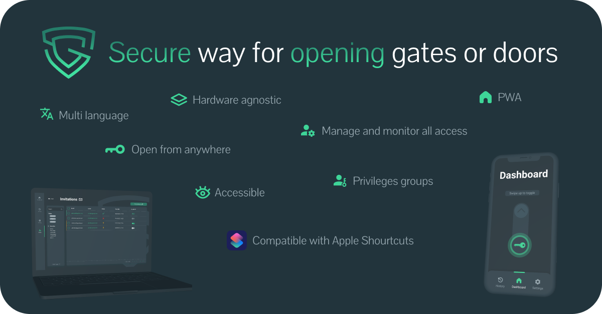

<h1 align="center">Smart Gate</h1>

<p align="center">
    <a href="https://github.com/Jozwiaczek/smart-gate">
        
    </a>
    <br>
    <i>🔐 Open source system for handling access to any physical entry gate.</i>
    <br>
    <br>
    <i>Created by <a href="https://github.com/Jozwiaczek"><b>Jakub Jóźwiak</b></a> and <a href='https://github.com/Mefjus'><b>Mateusz Nestorowicz</b></a></i>
</p>

<p align="center">
    Documentation:
    <a href="https://smart-gate-docs.vercel.app/"><strong>smart-gate-docs.vercel.app</strong></a>
    <br>
    <br>
    UI/UX:
    <a href="https://www.figma.com/file/MqlnLhknWh1u0Ho8z1Oefe/Smart-Gate?node-id=0%3A1"><strong>figma.com/smart-gate</strong></a>
    <br>
    <br>
    Storybook:
    <a href="https://main--6059282c88843d002106b484.chromatic.com"><strong>smart-gate.chromatic.com</strong></a>
</p>

<hr/>

<p align="center">⚠️ Smart Gate is still in heavy development ⚠️</p>

<hr/>

[](https://app.netlify.com/sites/smart-gate/deploys)
[](https://smart-gate-docs.vercel.app/)
[](https://github.com/Jozwiaczek/smart-gate/actions/workflows/continous_integration.yml)
[](https://img.shields.io/github/deployments/Jozwiaczek/smart-gate/smart-gate-jj?label=Server&logo=heroku&logoColor=heroku)
[](https://app.netlify.com/sites/smart-gate/deploys)
[](https://img.shields.io/github/deployments/Jozwiaczek/smart-gate/production?label=Documentation&logo=vercel&logoColor=vercel)
[](https://github.com/Jozwiaczek/smart-gate/commits)
[](https://www.codefactor.io/repository/github/jozwiaczek/smart-gate)
[](https://github.com/semantic-release/semantic-release)
[](#contributors-)
[](https://github.com/Jozwiaczek/smart-gate)

## 🚩 Table of Contents

- [About](#-about)
- [Setup for your own usage](#setup-for-your-own-usage)
  - [Deploy web application](#deploy-web-application)
  - [Deploy server](#deploy-server)
  - [Prepare your Raspberry Pi](#prepare-your-raspberry-pi)
- [Documentation](#documentation)
- [Contributing](#contributing)
  - [Contributing Guidelines](#contributing-guidelines)
  - [Want to Help?](#want-to-help?)
  - [Code of Conduct](#code-of-conduct)
- [Roadmap](#roadmap)
- [Changelog](#changelog)
- [Contributors](#contributors)
- [License](#license)

## 🔑 About



System for managing and handling access to any physical entry home gate or door.
The whole idea is to add smart control for your any already existed electric lock or gate.

Sounds familiar?
Right, but there is one significant difference between others smart lock, it is **COMPLETELY FREE**.

From physical side only what you have to do is to prepare [Raspberry Pi](https://www.raspberrypi.org/products/) and add some [3V Relay Module](https://www.google.com/search?q=relay+module+3v&tbm=isch&ved=2ahUKEwjll9aUt8_yAhVXvyoKHeMbBmgQ2-cCegQIABAA&oq=relay+module+3v&gs_lcp=CgNpbWcQAzIHCCMQ7wMQJzIGCAAQCBAeUKweWP8hYNEjaABwAHgAgAFliAGXApIBAzIuMZgBAKABAaoBC2d3cy13aXotaW1nwAEB&sclient=img&ei=o-wnYaW6Ldf-qgHjt5jABg&bih=1329&biw=2560&rlz=1C5CHFA_enPL923PL923) between Raspberry and your gate to enable ability for opening.

Rest part of Smart Gate system is handled by predefined templates for simplifying process of deploying server, database, and web app.
Only what you have to do in this step is to click 2 buttons from [Setup for your own usage](#setup-for-your-own-usage) and fill provided secrets.

After those steps You will transform your simply or even old gate/door into your private smart system.

https://user-images.githubusercontent.com/29049653/131034360-aef67a76-4060-4953-8ed0-3694fe3e4809.mp4

## 🚛 Quick setup for your own usage

> _Important note:_
> Bellow you will find only short and a temporary description on how to setup Smart Gate.
>
> More details will be added soon in [documentation website](https://smart-gate-docs.vercel.app/).

In order to use the Smart Gate system in your environment, you have to deploy your own instance
of the client, server and database.
To make it as simple as possible there is already a prepared template for deploying all packages.

What's important is that the whole setup and its usage is free, so You don't have to worry about any billing.

Why it's free because every part of this setup assumes usage of free tiers without any need to upgrades those pricing plans.

You only have to click the buttons below to deploy your own instances and fill up the required environment variables.

### Deploy web application

Click the button below to deploy [client package](packages/client/README.md) with prepared web application using predefined [Netlify](https://www.netlify.com) template.

[](https://app.netlify.com/start/deploy?repository=https://github.com/Jozwiaczek/smart-gate)

### Deploy server

Click the button below to deploy [api package](packages/api/README.md) with prepared server application using predefined [Heroku](https://www.heroku.com) template.

[](https://heroku.com/deploy?template=https://github.com/Jozwiaczek/smart-gate)

### Prepare your Raspberry Pi

#### One-Step Automated Install

Those who want to get started quickly and conveniently may install Smart Gate using the following command:

### `curl -sSL https://smart-gate-docs.vercel.app/install | bash`

#### Alternative Installation Methods

Piping to `bash` is controversial, as it prevents you from [reading code that is about to run](https://raw.githubusercontent.com/Jozwiaczek/smart-gate/main/packages/device/installer/installer.sh) on your system.
Therefore, we provide these alternative installation methods which allow code review before installation:

##### Method 1: Clone our repository and run

```bash
git clone --depth 1 https://github.com/Jozwiaczek/smart-gate.git
cd "smart-gate/packages/device/installer"
sudo bash installer.sh
```

##### Method 2: Manually download the installer and run

```bash
wget -O installer.sh https://smart-gate-docs.vercel.app/install
sudo bash installer.sh
```

#### Post install check

After completed successfully installation check is everything working properly.

Your Raspberry Pi should be initialized and connected with your server.

_Check **standard logs**:_

```bash
cat /var/log/smart-gate-standard.log
```

_Check **error logs**:_

```bash
cat /var/log/smart-gate-error.log
```

## 📖 Documentation

Check out our [documentation website](https://smart-gate-docs.vercel.app/).

## 🙏 Contributing

### Contributing Guidelines

Read the [contributing guide](CONTRIBUTING.md) to learn about our development process, how to propose bugfixes and improvements, and how to build and test your changes to Smart Gate.

### Want to Help?

Want to file a bug, contribute some code, or improve documentation? Excellent!

Read up on our guidelines for contributing and then check out one of our issues labeled as [](https://github.com/Jozwiaczek/smart-gate/issues?q=is%3Aopen+is%3Aissue+label%3A%22help-wanted%22) or [](https://github.com/Jozwiaczek/smart-gate/issues?q=is%3Aopen+is%3Aissue+label%3A%22good+first+issue%22).

### Code of Conduct

Help us keep Smart Gate open and inclusive. Please read and follow our [Code of Conduct](CODE_OF_CONDUCT.md).

## 📍 Roadmap

The future plans and high priority features and enhancements can be found in the [roadmap](https://github.com/Jozwiaczek/smart-gate/projects/1).

## 📈 Changelog

For details about the latest updates check the [changelog](CHANGELOG.md).

## Contributors ✨

Thanks goes to these wonderful people ([emoji key](https://allcontributors.org/docs/en/emoji-key)):

<!-- ALL-CONTRIBUTORS-LIST:START - Do not remove or modify this section -->
<!-- prettier-ignore-start -->
<!-- markdownlint-disable -->
<table>
  <tr>
    <td align="center"><a href="https://github.com/Jozwiaczek"><br /><sub><b>Jakub Jóźwiak</b></sub></a><br /><a href="https://github.com/Jozwiaczek/smart-gate/commits?author=Jozwiaczek" title="Code">💻</a> <a href="https://github.com/Jozwiaczek/smart-gate/commits?author=Jozwiaczek" title="Documentation">📖</a> <a href="#design-Jozwiaczek" title="Design">🎨</a> <a href="#ideas-Jozwiaczek" title="Ideas, Planning, & Feedback">🤔</a> <a href="#infra-Jozwiaczek" title="Infrastructure (Hosting, Build-Tools, etc)">🚇</a> <a href="https://github.com/Jozwiaczek/smart-gate/pulls?q=is%3Apr+reviewed-by%3AJozwiaczek" title="Reviewed Pull Requests">👀</a></td>
    <td align="center"><a href="https://github.com/Mefjus"><br /><sub><b>Mefjus</b></sub></a><br /><a href="https://github.com/Jozwiaczek/smart-gate/commits?author=Mefjus" title="Code">💻</a> <a href="#ideas-Mefjus" title="Ideas, Planning, & Feedback">🤔</a> <a href="https://github.com/Jozwiaczek/smart-gate/pulls?q=is%3Apr+reviewed-by%3AMefjus" title="Reviewed Pull Requests">👀</a></td>
    <td align="center"><a href="https://github.com/nikofiko123"><br /><sub><b>nikofiko123</b></sub></a><br /><a href="#design-nikofiko123" title="Design">🎨</a></td>
    <td align="center"><a href="https://github.com/Vatras"><br /><sub><b>Vatras</b></sub></a><br /><a href="https://github.com/Jozwiaczek/smart-gate/pulls?q=is%3Apr+reviewed-by%3AVatras" title="Reviewed Pull Requests">👀</a></td>
  </tr>
</table>

<!-- markdownlint-restore -->
<!-- prettier-ignore-end -->

<!-- ALL-CONTRIBUTORS-LIST:END -->

This project follows the [all-contributors](https://github.com/all-contributors/all-contributors) specification. Contributions of any kind welcome!

## License

Copyright 2020 Jakub Jóźwiak.
Licensed under the [MIT license](LICENSE).
