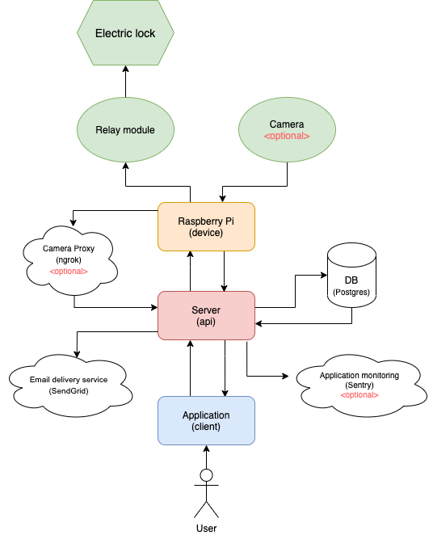

# Overview

In order to use the Smart Gate system in your environment, you have to deploy your own instance
of the client, server and database.
To make it as simple as possible there is already a prepared template for deploying all packages.

What's important is that the whole setup and its usage is free, so You don't have to worry about any billing.

Why it's free because every part of this setup assumes usage of free tiers without any need to upgrades those pricing plans.

You only have to click the buttons below to deploy your own instances and fill up the required environment variables.

## Why & How it's Completely Free

## Architecture

